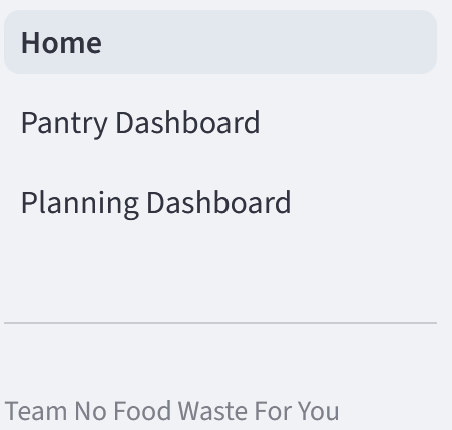

# 🥘 Team No Food Waste For You
### Streamlit Meal Planner • Pantry Tracker • Trader Joe’s Database

A full-stack system designed to **reduce household food waste** using Trader Joe’s products, structured recipes, and a virtual pantry system.

This project includes:

- 🗄️ A SQLite database containing Trader Joe’s product data, recipe ingredients, pantry stock, and usage logs
- 🥗 A Streamlit meal-planning and pantry-management application
- 🔄 A full ingredient-to-product matching pipeline
- 🧮 A recipe recommender system powered by waste-risk scoring
- 🤖 Supporting ML components (ingredient classifier, product classifier)

---

# 🚀 Running the Application

The application is self-contained and runs locally. Use the startup script for your operating system:

### **Windows**
```
team-no-food-waste-for-you\app_start.bat
```

### **Mac / Linux**
Before running:
```
chmod +x app_start.sh
```

Run:
```
./app_start.sh
```

Running the appropriate script will automatically:

- create a Python virtual environment
- install all required packages (first run: ~5–10 min)
- create the SQLite database (`team-no-food-waste-for-you.sqlite`)
- build tables defined in `database/tables.py`
- populate recipes, ingredients, and Trader Joe’s products
- execute all cleaning & parsing pipelines

After initial setup, future launches skip installation and start the Streamlit server immediately.

### **Startup Example**


---

# 🧭 Navigating the Streamlit App

The application is organized into **three main dashboards**, accessible from the left sidebar.

> 💡 *Tip: The Pantry Dashboard includes a **Sample Pantry** button that fills your pantry with realistic items and expiration dates for exploration.*



---

# 🏠 Home Dashboard

Provides a high-level overview of your current household food system.

## **Summary Statistics**
- **Total Pantry Items** — number of food items currently stored
- **Recipes Planned** — number of recipes scheduled
- **Next Meal Planned** — the next meal you're set to make
- **Meals Planned This Week** — weekly meal count

## **Waste & Pantry Analytics**

### Expiring Food Forecast
Highlights which items are approaching expiration.

### Consumption vs Waste Over Time
Compares planned meal usage with predicted food waste over the next two years.

### Realized vs Avoided Waste
Shows actual waste vs. prevented waste.


### Recipe–Product Overlap Network
Visualizes how ingredients in recipes map to Trader Joe’s products.


---

# 🧺 Pantry Dashboard

Your central hub for managing a virtual pantry.

## **Pantry Overview**
View your items, quantities, and expiration timelines.


## **Category Consumption Insights**
- Total Category Consumed by Category and product as a treemap.


## **Pantry Controls**
- **Clear Pantry** — empty pantry (not counted as waste)
- **Trash Pantry** — empty pantry (counted as waste)
- **Trash Expired** — remove expired food, counted as waste


## **Add Items**
Choose a category, select a product, choose quantity.


## **Manage Items**
Remove or adjust pantry items.

## **Pantry Insights**
- **Pantry Roll-Up** table showing standardized item amounts
- **Items Expiring Soon** table
- **Expiration Forecast Histogram**


---

# 📅 Planning Dashboard

The central location for scheduling recipes and forecasting usage.

> 💬 *A “How Planning Works” guide appears on the sidebar for quick reference.*

## **Refresh Recommendations**
Updates recommendations when pantry contents change.

## **Recommendation Filters**
Control how many missing ingredients you’re willing to purchase.

## **Meal Plan Overview**
Visualizes what types of meals are planned throughout the week.


---

# 🍽️ Recommendation by Category

Browse top personalized recipe recommendations based on:

- Pantry contents
- Allowed missing ingredients
- Ingredient expiration timelines
- Product overlap

Recipes are grouped by:

**Breakfast • Lunch • Dinner • Appetizers & Sides • Desserts • Beverages**

Example recommended recipe:


---

# 📋 Planning Queue

- Click **+ Add** to add a recipe to its category
- Select a day & meal time, then confirm
- The weekly overview updates automatically

---

# 🤖 Recipe Recommender Logic

A core focus of the project is computing a **Waste-Risk Score** for each recipe.

## **1. Item-Level Scoring**
```
0 if expired OR if no shelf life exists
Score = urgency * category_multiplier
urgency = 1 / max(time_remaining, 1)
```
This prioritizes items closer to expiring and categories with higher waste impact.

## **2. Recipe-Level Scoring**
For each ingredient in a recipe:

1. If no matched product → mark as external
2. If matched but not in pantry → mark as missing
3. If multiple pantry items exist → use items expiring soonest first
4. Check if pantry quantities satisfy ingredient requirements
5. Compute per-unit waste-risk contribution

Ingredients accumulate to form a **Total Waste-Risk Score**.

Recipes are sorted and returned by score.

---

# 🧠 Logic Pipeline Overview

### **1. Parse Recipe Ingredients**
Convert raw ingredient text into structured fields.

### **2. Match Ingredients to Trader Joe’s Products**
Using fuzzy matching & NLP similarity → stored as `matched_product_id`.

### **3. Convert Quantities to Pantry Units**
Standardizes recipe units into comparable pantry units.

### **4. Generate Recipe Recommendations**
Computed using pantry inventory and ingredient mapping.

### **5. Record User Selections**
Logged in `RecipeSelected`.

### **6. Continuous Updates & Visualization**
Real-time updates as users modify pantry items or plan meals.

---

# 📊 Visual System Updates

The interface always reflects the most current state of:

- Pantry
- Recipe plans
- Ingredient availability
- Waste forecasts

Including interactive Altair + Plotly charts.

