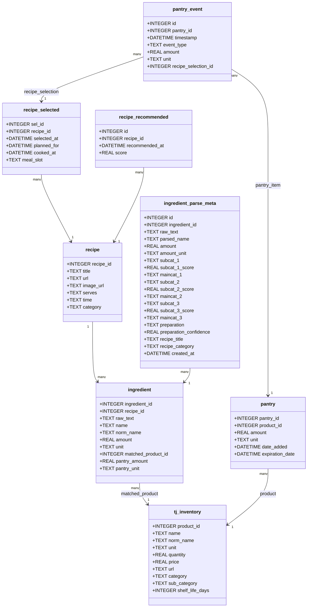

```mermaid
classDiagram

  class recipe {
    +INTEGER recipe_id
    +TEXT title
    +TEXT url
    +TEXT image_url
    +TEXT serves
    +TEXT time
    +TEXT category
  }

  class ingredient {
    +INTEGER ingredient_id
    +INTEGER recipe_id
    +TEXT raw_text
    +TEXT name
    +TEXT norm_name
    +REAL amount
    +TEXT unit
    +INTEGER matched_product_id
    +REAL pantry_amount
    +TEXT pantry_unit
  }

  class tj_inventory {
    +INTEGER product_id
    +TEXT name
    +TEXT norm_name
    +TEXT unit
    +REAL quantity
    +REAL price
    +TEXT url
    +TEXT category
    +TEXT sub_category
    +INTEGER shelf_life_days
  }

  class pantry {
    +INTEGER pantry_id
    +INTEGER product_id
    +REAL amount
    +TEXT unit
    +DATETIME date_added
    +DATETIME expiration_date
  }

  class pantry_event {
    +INTEGER id
    +INTEGER pantry_id
    +DATETIME timestamp
    +TEXT event_type
    +REAL amount
    +TEXT unit
    +INTEGER recipe_selection_id
  }

  class recipe_recommended {
    +INTEGER id
    +INTEGER recipe_id
    +DATETIME recommended_at
    +REAL score
  }

  class recipe_selected {
    +INTEGER sel_id
    +INTEGER recipe_id
    +DATETIME selected_at
    +DATETIME planned_for
    +DATETIME cooked_at
    +TEXT meal_slot
  }

  class ingredient_parse_meta {
    +INTEGER id
    +INTEGER ingredient_id
    +TEXT raw_text
    +TEXT parsed_name
    +REAL amount
    +TEXT amount_unit
    +TEXT subcat_1
    +REAL subcat_1_score
    +TEXT maincat_1
    +TEXT subcat_2
    +REAL subcat_2_score
    +TEXT maincat_2
    +TEXT subcat_3
    +REAL subcat_3_score
    +TEXT maincat_3
    +TEXT preparation
    +REAL preparation_confidence
    +TEXT recipe_title
    +TEXT recipe_category
    +DATETIME created_at
  }

  recipe "1" --> "many" ingredient
  ingredient "many" --> "1" tj_inventory : matched_product
  pantry "many" --> "1" tj_inventory : product
  pantry_event "many" --> "1" pantry : pantry_item
  recipe_selected "many" --> "1" recipe
  pantry_event "many" --> "1" recipe_selected : recipe_selection
  recipe_recommended "many" --> "1" recipe
  ingredient_parse_meta "many" --> "1" ingredient

```